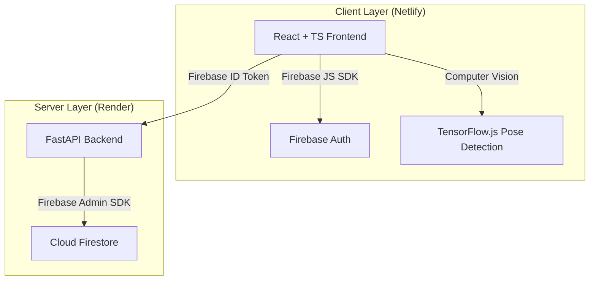

# FLEX-IT-OUT 🏋️‍♂️💪

FLEX-IT-OUT is an AI-powered fitness companion that tracks workouts, evaluates exercise form in real time using computer vision, and lets users earn points and compete with friends on a leaderboard.

Posture analysis runs entirely **in the browser** via TensorFlow.js, and the backend is built on a lightweight FastAPI service backed by **Google Firebase** (Firestore + Auth).

---

## 🏗️ Architecture Overview



**Read paths** (leaderboard updates, friend activity, notifications) are designed to use Firestore's native real-time listeners (`onSnapshot`) directly from the client where possible, rather than polling the backend.

**Write paths** that affect points, workout completion, and gamification state are routed through the FastAPI backend, which validates the caller's Firebase ID token via the Admin SDK before writing to Firestore. Keeping these writes server-side (rather than direct client writes governed only by Firestore security rules) makes it easier to enforce rate limits and sanity checks on submitted workout data.

### Database & Session Management
All persistent storage — users, workouts, friend requests, notifications, points, and gamification metrics — lives in **Cloud Firestore**.

* **Offline fallback for local development**: if Firebase service credentials are not present, the backend falls back to an in-memory dictionary store (`_OFFLINE_DB`) so the app remains fully testable without a live Firebase project.
* ⚠️ This fallback is intended for local development only. In any deployed environment, missing credentials should fail startup loudly rather than silently serving from memory — see [Known Limitations](#-known-limitations--roadmap).

### Authentication
* Handled by **Firebase Authentication**, supporting email/password and Google Sign-In.
* Backend routes are protected by a FastAPI dependency that decodes and verifies Firebase ID tokens via the Firebase Admin SDK.

---

## ✨ Features

* **Real-time posture analysis** — computer vision evaluates squats, pushups, lunges, jumping jacks, planks, mountain climbers, and burpees, with instant audio-visual feedback.
* **Gamification & points** — points are awarded based on completed workouts, with rep cycles calculated automatically from pose data.
* **Social graph** — send and accept friend requests, and compare scores with friends.
* **Global leaderboard** — rankings based on total accumulated points.
* **Notifications** — alerts for friend activity, achievements, and workout reminders.

---

## 🛠️ Technology Stack

| Layer | Technologies |
|---|---|
| Frontend | React, TypeScript, Vite, TailwindCSS, Radix UI (Shadcn), Lucide React |
| Backend | Python 3.11+, FastAPI, Uvicorn, PyJWT (offline/local auth testing) |
| Database & Auth | Google Firebase — Firestore, Firebase Auth, Google OAuth |
| AI Model | TensorFlow.js Pose Detection (MoveNet / BlazePose), running client-side |

---

## 📁 Repository Structure

```
├── backend/
│   ├── app/
│   │   ├── auth.py              # Authentication & friendship routes
│   │   ├── db.py                # Firebase Admin connection & repository layer
│   │   ├── main.py               # Router mounting & server config
│   │   ├── models.py             # Pydantic schemas
│   │   ├── points.py             # Point calculation & gamification logic
│   │   └── workout.py            # Workout sessions & history
│   ├── main.py                   # ASGI entrypoint (Render)
│   ├── requirements.txt
│   └── test_user_data.py         # Integration tests
└── frontend/
    ├── src/
    │   ├── components/
    │   │   ├── auth/              # AuthTabs.tsx — Firebase client login flows
    │   │   ├── dashboard/         # Workout dashboard
    │   │   ├── settings/          # Settings.tsx — profile & sign-out
    │   │   └── workout/           # Webcam-based pose detection interface
    │   ├── lib/
    │   │   ├── api.ts             # API client & token propagation
    │   │   └── firebaseClient.ts  # Firebase web SDK initialization
    │   └── App.tsx
    ├── package.json
    └── vite.config.ts
```

---

## 🚀 Local Installation & Setup

### Prerequisites
* Python 3.11+
* Node.js 18+

### 1. Backend

```bash
cd backend
python -m venv venv
source venv/bin/activate      # macOS/Linux
venv\Scripts\activate         # Windows
pip install -r requirements.txt
```

Create `backend/.env`:

```env
JWT_SECRET=your-local-jwt-secret-key
FIREBASE_SERVICE_ACCOUNT_KEY=firebase-key.json
FIREBASE_API_KEY=your_firebase_web_api_key
```

Optionally, download your Firebase service account key (Project Settings → Service Accounts) and save it as `backend/firebase-key.json`. If omitted, the backend starts in offline fallback mode automatically.

### 2. Frontend

```bash
cd frontend
npm install
```

Create `frontend/.env`:

```env
VITE_FIREBASE_API_KEY=your_firebase_web_api_key
VITE_FIREBASE_AUTH_DOMAIN=your_project.firebaseapp.com
VITE_FIREBASE_PROJECT_ID=your_project_id
VITE_FIREBASE_STORAGE_BUCKET=your_project.firebasestorage.app
VITE_FIREBASE_MESSAGING_SENDER_ID=your_sender_id
VITE_FIREBASE_APP_ID=your_app_id
VITE_API_URL=http://localhost:8000
```

---

## 🏃 Running Locally

**Backend** — runs at [http://localhost:8000](http://localhost:8000):
```bash
cd backend
uvicorn app.main:app --reload
```

**Frontend** — runs at [http://localhost:8080](http://localhost:8080):
```bash
cd frontend
npm run dev
```

**Tests**:
```bash
cd backend
python test_user_data.py
python test_all_endpoints.py
```

---

## 🌐 Deployment

### Backend (Render)
* **Start command**: `uvicorn main:app --host 0.0.0.0 --port $PORT`
* **Environment variables**:
  * `FIREBASE_API_KEY` — Firebase Web API key.
  * `FIREBASE_SERVICE_ACCOUNT_JSON` — full contents of `firebase-key.json`, pasted as a single string and parsed at startup. *(Consider migrating to a Render Secret File to avoid JSON-escaping issues in the env var UI.)*

### Frontend (Netlify)
* **Build command**: `npm run build`
* **Publish directory**: `dist`
* **Environment variables**: add all `VITE_*` keys under Site Settings → Environment Variables (Same value for all deploy contexts), then trigger a redeploy.
* **Authorized domain**: add your `*.netlify.app` domain under Firebase Console → Authentication → Settings → Authorized Domains so Google Sign-In popups work.

---

## ⚠️ Known Limitations & Roadmap

* **Workout integrity**: rep counts currently originate from client-side pose detection and are trusted by the points API. Planned mitigation: server-side rate limiting and bounds-checking on submitted workout data to deter spoofed completions.
* **Production fallback safety**: offline mode should be restricted to local/dev environments; production deploys with missing Firebase credentials should fail startup rather than silently running on in-memory storage.
* **Leaderboard scaling**: current leaderboard queries run directly against the users collection. A denormalized `leaderboards` collection (updated via Firestore triggers) is planned for better performance at scale.
* **Async/Firestore calls**: auditing backend routes to ensure synchronous Firebase Admin SDK calls don't block the FastAPI event loop under concurrent load.

---

## 📄 License

Add your license of choice here (e.g. MIT).
